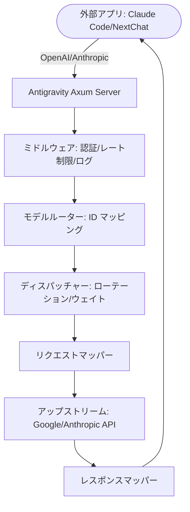

# Antigravity Tools 🚀

<div align="center">
  

  <h3>あなた専用の高性能 AI ディスパッチゲートウェイ</h3>
  <p>Gemini & Claude をシームレスにプロキシ。OpenAI 互換。プライバシー重視。</p>

  <p>
    <a href="https://github.com/lbjlaq/Antigravity-Manager">
      
    </a>
    
    
    
    
  </p>

  <p>
    <a href="#-主要機能">主要機能</a> •
    <a href="#-インターフェース概要">インターフェース</a> •
    <a href="#-アーキテクチャ">アーキテクチャ</a> •
    <a href="#-インストール">インストール</a> •
    <a href="#-クイックスタート">クイックスタート</a>
  </p>

  <p>
    <a href="./README.md">简体中文</a> |
    <a href="./README_EN.md">English</a> |
    <strong>日本語</strong>
  </p>
</div>

---

**Antigravity Tools** は、開発者と AI 愛好家のために設計されたオールインワンのデスクトップアプリケーションです。マルチアカウント管理、プロトコル変換、スマートリクエストスケジューリングを完璧に統合し、安定・高速・低コストな **ローカル AI 中継ステーション** を提供します。

このアプリを活用することで、一般的な Web セッション (Google/Anthropic) を標準化された API インターフェースに変換し、異なるプロバイダー間のプロトコルの壁を完全に取り除くことができます。

## 🌟 主要機能

### 1. 🎛️ スマートアカウントダッシュボード
*   **グローバルリアルタイム監視**: Gemini Pro、Gemini Flash、Claude、Gemini 画像生成の **平均残りクォータ** を含む、すべてのアカウントの健全性を一目で把握。
*   **スマートレコメンデーション**: クォータの余裕度に基づくリアルタイムアルゴリズムで「ベストアカウント」をフィルタリング・推奨し、**ワンクリック切り替え** をサポート。
*   **アクティブアカウントスナップショット**: 現在アクティブなアカウントの具体的なクォータ割合と最終同期時刻を視覚的に表示。

### 2. 🔐 パワフルなアカウントマネージャー
*   **OAuth 2.0 認証 (自動/手動)**: アカウント追加時にコピー可能な認証 URL を事前生成。任意のブラウザで認証を完了でき、コールバック成功後にアプリが自動的に保存を完了（必要に応じて「認証済み、続行」をクリック）。
*   **多次元インポート**: 単一トークン入力、JSON 一括インポート、V1 レガシーデータベースからの自動ホットマイグレーションをサポート。
*   **ゲートウェイレベルビュー**: 「リスト」と「グリッド」のデュアルビュー切り替えをサポート。403 禁止検出機能を提供し、権限異常のあるアカウントを自動的にマーク・スキップ。

### 3. 🔌 プロトコル変換 & リレー (API プロキシ)
*   **マルチプロトコル対応 (Multi-Sink)**:
    *   **OpenAI フォーマット**: `/v1/chat/completions` エンドポイントを提供し、既存の AI アプリの 99% と互換性あり。
    *   **Anthropic フォーマット**: ネイティブ `/v1/messages` インターフェースを提供し、**Claude Code CLI** の全機能（思考連鎖、システムプロンプトなど）をサポート。
    *   **Gemini フォーマット**: Google 公式 SDK からの直接呼び出しをサポート。
*   **スマート自己修復**: リクエストが `429 (Too Many Requests)` や `401 (Expired)` に遭遇した場合、バックエンドが **ミリ秒レベルの自動リトライとサイレントローテーション** をトリガーし、ビジネス継続性を確保。

### 4. 🔀 モデルルーターセンター
*   **シリーズベースマッピング**: 複雑なオリジナルモデル ID を「シリーズグループ」に分類（例: すべての GPT-4 リクエストを `gemini-3-pro-high` に統一ルーティング）。
*   **エキスパートリダイレクト**: カスタム正規表現レベルのモデルマッピングをサポートし、すべてのリクエストのランディングモデルを精密にコントロール。

### 5. 🎨 マルチモーダル & Imagen 3 サポート
*   **高度な画像コントロール**: OpenAI の `size` パラメータ（例: `1024x1024`、`16:9`）またはモデル名サフィックスによる画像生成タスクの精密制御をサポート。
*   **大容量ペイロードサポート**: バックエンドは最大 **100MB** のペイロードをサポートし、4K HD 画像認識・処理に十分対応。

## 📸 インターフェース概要

````carousel

<!-- slide -->

<!-- slide -->

<!-- slide -->

<!-- slide -->

````

## 🏗️ アーキテクチャ



## 📥 インストール

### オプション A: macOS ターミナル (推奨)
[Homebrew](https://brew.sh/) がインストールされている場合は、以下を実行:

```bash
# 1. リポジトリを Tap
brew tap lbjlaq/antigravity-manager https://github.com/lbjlaq/Antigravity-Manager

# 2. アプリをインストール
brew install --cask antigravity-tools
# 権限の問題が発生した場合
brew install --cask --no-quarantine antigravity
```

### オプション B: 手動ダウンロード
[GitHub Releases](https://github.com/lbjlaq/Antigravity-Manager/releases) からダウンロード:
*   **macOS**: `.dmg` (ユニバーサル、Apple Silicon & Intel)
*   **Windows**: `.msi` またはポータブル版 `.zip`
*   **Linux**: `.deb` または `AppImage`

### 🛠️ トラブルシューティング

#### macOS で「アプリが壊れている」と表示される場合
macOS のセキュリティ Gatekeeper により、App Store 以外からダウンロードしたアプリでこのメッセージが表示される場合があります。ターミナルで以下を実行して修正:
```bash
sudo xattr -rd com.apple.quarantine "/Applications/Antigravity Tools.app"
```

## 🔌 クイックスタート

### 🔐 OAuth 認証フロー (アカウント追加)
1. `Accounts / アカウント` → `アカウント追加` → `OAuth` を開く。
2. ダイアログでボタンをクリックする前に認証 URL が事前生成されます。URL をクリックしてシステムクリップボードにコピーし、お好みのブラウザで開いて認証を完了。
3. 同意後、ブラウザがローカルコールバックページを開き「✅ 認証成功!」と表示。
4. アプリが自動的にフローを続行してアカウントを保存。自動で完了しない場合は「認証済み、続行」をクリックして手動で完了。

> 注意: 認証 URL にはワンタイムのローカルコールバックポートが含まれています。常にダイアログに表示される最新の URL を使用してください。認証中にアプリが実行されていないか、ダイアログが閉じられている場合、ブラウザに `localhost refused connection` と表示されることがあります。

### Claude Code CLI での使用方法
1. 「API プロキシ」タブで Antigravity サービスを起動。
2. ターミナルで:
```bash
export ANTHROPIC_API_KEY="sk-antigravity"
export ANTHROPIC_BASE_URL="http://127.0.0.1:8045"
claude
```

### Kilo Code での使用方法
1.  **プロトコル選択**: **Gemini プロトコル** を優先的に使用することを推奨。
2.  **Base URL**: `http://127.0.0.1:8045` を入力。
3.  **注意**:
    - **OpenAI プロトコルの制限**: Kilo Code は OpenAI モードを使用すると、リクエストパスが `/v1/chat/completions/responses` のような非標準パスになり、Antigravity が 404 を返します。必ず Base URL を入力後に Gemini モードを選択してください。
    - **モデルマッピング**: Kilo Code のモデル名は Antigravity のデフォルト設定と一致しない場合があります。接続できない場合は「モデルマッピング」ページでカスタムマッピングを設定し、**ログファイル** を確認してデバッグしてください。

### Python での使用方法
```python
import openai

client = openai.OpenAI(
    api_key="sk-antigravity",
    base_url="http://127.0.0.1:8045/v1"
)

response = client.chat.completions.create(
    model="gemini-3-flash",
    messages=[{"role": "user", "content": "こんにちは、自己紹介をしてください"}]
)
print(response.choices[0].message.content)
```

## 📝 開発者 & コミュニティ

*   **変更履歴 (Changelog)**:
    *   **v3.3.0 (2025-12-27)**:
        - **メジャーアップデート**:
            - **Codex CLI & Claude CLI の深層対応 (コア貢献者 @llsenyue PR #93)**:
                - **コーディングエージェント互換性**: Codex CLI の完全サポートを実現。`/v1/responses` エンドポイントの深層対応とシェルツール呼び出しのインテリジェント変換 (SSOP) を含む。
                - **Claude CLI 推論強化**: グローバル `thoughtSignature` ストレージとバックフィルロジックを導入し、Claude CLI で Gemini 3 シリーズモデル使用時の署名検証エラーを完全に解決。
            - **OpenAI プロトコルスタック再構築**:
                - **新 Completions エンドポイント**: `/v1/completions` と `/v1/responses` ルートの完全サポートを追加し、レガシー OpenAI クライアントとの互換性を確保。
                - **マルチモーダル & スキーマクリーニングの融合**: 自社開発の高性能画像解析とコミュニティ貢献の高精度 JSON Schema フィルタリング戦略を統合。
            - **プライバシー重視のネットワークバインディング制御 (コア貢献者 @kiookp PR #91)**:
                - **デフォルトローカルホスト**: プロキシサーバーはデフォルトで `127.0.0.1` (ローカルホストのみ) をリッスンし、プライバシーとセキュリティを確保。
                - **オプション LAN アクセス**: `allow_lan_access` 設定トグルを追加。有効にすると `0.0.0.0` をリッスンして LAN デバイスからのアクセスを許可。
                - **セキュリティ警告**: フロントエンド UI で明確なセキュリティ警告とステータスヒントを提供。
        - **フロントエンド UX アップグレード**:
            - **プロトコルエンドポイント可視化**: API プロキシページにエンドポイント詳細表示を追加し、Chat、Completions、Responses エンドポイントの個別クイックコピーをサポート。
    *   **v3.2.8 (2025-12-26)**:
        - **バグ修正**:
            - **OpenAI プロトコル マルチモーダル & ビジョンモデルサポート**: OpenAI プロトコルでビジョンモデル（例: `gemini-3-pro-image`）に画像リクエストを送信した際の `content` フォーマット不一致による 400 エラーを修正。
            - **完全なビジョン機能強化**: OpenAI プロトコルで Base64 画像の自動解析とアップストリーム `inlineData` へのマッピングをサポートし、Claude プロトコルと同等の画像処理能力を提供。
    *   **v3.2.7 (2025-12-26)**:
        - **新機能**:
            - **起動時に自動起動**: システム起動時に Antigravity Tools を自動起動する機能を追加。設定の「一般」タブで有効/無効を切り替え可能。
            - **アカウントリストページサイズセレクター**: アカウントページのページネーションバーにページサイズセレクターを追加し、設定に入ることなくページあたりの項目数（10/20/50/100）を直接選択可能に。
        - **バグ修正**:
            - **包括的 JSON Schema クリーンアップ強化 (MCP ツール互換性修正)**:
                - **高度なスキーマフィールドの削除**: MCP ツールで一般的に使用されるが Gemini でサポートされていない `propertyNames`、`const`、`anyOf`、`oneOf`、`allOf`、`if/then/else`、`not` などの高度な JSON Schema フィールドの削除を追加し、Claude Code v2.0.76+ で MCP ツール使用時の 400 エラーを完全に解決。
                - **再帰順序の最適化**: 親ノードを処理する前に子ノードを再帰的にクリーンアップするよう調整し、ネストされたオブジェクトが誤って description にシリアライズされるのを防止。
                - **Protobuf 型互換性**: ユニオン型配列（例: `["string", "null"]`）を単一型にダウングレードすることを強制し、"Proto field is not repeating" エラーを解決。
                - **スマートフィールド認識**: 値が期待される型と一致する場合にのみ検証フィールドを削除するよう型チェックロジックを強化し、`pattern` などの名前のプロパティ定義の誤削除を防止。
            - **カスタムデータベースインポート修正**: `import_custom_db` コマンド未登録による「Import from Custom DB」機能の "Command not found" エラーを修正。カスタム `state.vscdb` ファイルからのアカウントインポートが正常に動作。
            - **プロキシ安定性 & 画像生成最適化**:
                - **スマート 429 バックオフメカニズム**: `RetryInfo` 解析を深く統合し、安全冗長性を追加して Google API リトライ指示に厳密に従い、アカウント停止リスクを効果的に削減。
                - **精密エラートリアージ**: レート制限をクォータ枯渇と誤認識するロジックを修正（"check quota" エラーでの誤停止を解消）し、スロットリング時の自動アカウントローテーションを確保。
                - **並列画像生成加速**: `image_gen` リクエストの 60 秒タイムウィンドウロックを無効化し、複数アカウント間の高速ローテーションを実現、Imagen 3 の 429 エラーを完全に解決。
    *   **v3.2.6 (2025-12-26)**:
        - **重要な修正**:
            - **Claude プロトコル深層最適化 (Claude Code 体験強化)**:
                - **動的 ID マッピング**: リクエストモデルに基づいて ID 保護パッチを動的に注入し、ネイティブ Anthropic ID をロックしてベースラインプラットフォームの命令干渉を遮断。
                - **ツール空出力補償**: `mkdir` などのサイレントコマンド専用に、空出力を明示的な成功シグナルに自動マッピングし、Claude CLI でのタスクフロー中断とハルシネーションを解決。
                - **グローバル停止シーケンス設定**: プロキシリンク用に `stopSequences` を最適化し、ストリーミング出力を正確にカットオフして末尾冗長性による解析エラーを完全に解決。
                - **スマートペイロードクリーニング (Smart Panic Fix)**: `GoogleSearch` と `FunctionCall` の相互排他チェックを導入し、バックグラウンドタスクリダイレクト (Token Saver) 時の自動ツールストリッピングを実装、**400 ツール競合 (Multiple tools)** エラーを完全に排除。
                - **プロキシ信頼性強化 (コア貢献者 @salacoste PR #79)**:
                    - **スマート 429 バックオフ**: アップストリーム `RetryInfo` の解析をサポートし、レート制限時に自動的に待機・リトライして不要なアカウントローテーションを削減。
                    - **Resume フォールバック**: `/resume` 400 署名エラーに対する Thinking ブロック自動ストリッピングを実装し、セッション復旧成功率を向上。
                    - **拡張スキーマサポート**: 再帰的 JSON Schema クリーニングを改善し、`enumCaseInsensitive` などの拡張フィールドのフィルタリングを追加。
            - **テストスイート強化**: `mappers` テストモジュールの欠落インポートと重複属性エラーを修正し、コンテンツブロックマージと空出力補完の新テストを追加。
    *   **v3.2.1 (2025-12-25)**:
        - **新機能**:
            - **カスタム DB インポート**: 任意の `state.vscdb` ファイルパスからのアカウントインポートをサポートし、バックアップやカスタムロケーションからのデータ復旧を容易に。
            - **リアルタイム Project ID 同期 & 永続化**: クォータ更新時に最新の `project_id` をリアルタイムでキャプチャしてローカルデータベースに保存。
            - **OpenAI & Gemini プロトコル強化**:
                - **統一モデルルーティング**: **Gemini プロトコルもカスタムモデルマッピングをサポート**。これで OpenAI、Anthropic、Gemini の 3 大プロトコル全体でスマートルーティングロジックの統合が完了。
                - **完全ツール呼び出しサポート**: ストリーミング・非ストリーミングレスポンス両方で `functionCall` 結果（例: 検索）を正しく処理・配信し、「空出力」エラーを完全に解決。
                - **リアルタイム Thought 表示**: `<thought>` タグ経由で Gemini 2.0+ の推論プロセスを自動抽出・表示し、推論情報の損失なし。
                - **高度なパラメータマッピング**: `stop` シーケンス、`response_format` (JSON モード)、カスタム `tools` の完全マッピングサポートを追加。
        - **バグ修正**:
            - **単一アカウント切り替え制限修正**: アカウントが 1 つしかない場合に切り替えボタンが非表示になる問題を解決。単一アカウントでも切り替えボタンクリックで手動トークン注入をトリガー可能に。
            - **OpenAI カスタムマッピング 404 修正**: マッピングされたアップストリームモデル ID が使用されるようモデルルーティングロジックを修正し、カスタムマッピング時の 404 エラーを解決。
            - **プロキシリトライロジック最適化**: スマートエラー認識とリトライ制限を導入。404 と 429 (クォータ枯渇) のフェイルファストプロテクションを実装。
            - **JSON Schema 深層クリーンアップ (互換性強化)**: Gemini でサポートされていない 20 以上の拡張フィールド（例: `multipleOf`、`exclusiveMinimum`、`pattern`、`const`、`if-then-else`）を自動フィルタリングする統一クリーンアップメカニズムを確立し、CLI ツールが API 経由でツールを呼び出す際の 400 エラーを解決。
            - **Claude Thinking Chain 検証修正**: Thinking 有効時に `assistant` メッセージが thinking ブロックで始まる必要がある構造検証問題を解決。プレースホルダー thinking ブロックの自動注入とテキストからの `<thought>` タグ自動復元をサポートし、Claude Code などの高度なツールでの長時間会話の安定性を確保。
            - **OpenAI 適応修正**: 一部のクライアントが `system` メッセージを送信するとエラーが発生する問題を解決。
    *   **v3.2.0 (2025-12-24)**:
        - **コアアーキテクチャ再構築**:
            - **プロキシエンジン書き換え**: `proxy` サブシステムを完全にモジュール化し、`mappers`、`handlers`、`middleware` を分離して優れた保守性を実現。
            - **Linux プロセス管理**: メイン/ヘルパープロセスを区別するスマートプロセス識別を実装し、`SIGTERM` による正常終了と `SIGKILL` フォールバックを確保。
        - **Homebrew サポート**: `brew install --cask antigravity` による macOS ワンクリックインストールを正式サポート。
        - **GUI UX 革命**: 平均クォータ監視と「ベストアカウント推奨」アルゴリズムでダッシュボードを刷新。
        - **プロトコル & ルーター拡張**: OpenAI、Anthropic (Claude Code)、Gemini プロトコルをネイティブサポートし、高精度モデルルーターを搭載。
        - **マルチモーダル最適化**: 100MB ペイロード容量とアスペクト比コントロールで Imagen 3 を深層対応。
        - **グローバルアップストリームプロキシ**: ホットリロード対応の HTTP/SOCKS5 プロトコルをサポートする集中リクエスト管理。
    *   過去の履歴は [Releases](https://github.com/lbjlaq/Antigravity-Manager/releases) を参照。
*   **ライセンス**: **CC BY-NC-SA 4.0**。非商用利用のみ。
*   **セキュリティ**: すべてのアカウントデータは暗号化されてローカル SQLite データベースに保存されます。同期が有効になっていない限り、データがデバイスから離れることはありません。

---

<div align="center">
  <p>このツールが役に立ったら、GitHub で ⭐️ をお願いします!</p>
  <p>Copyright © 2025 Antigravity Team.</p>
</div>
