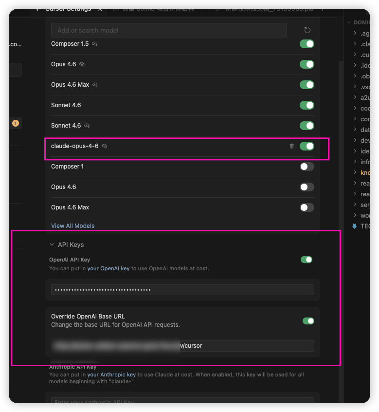

# API Reference (v4.0.3)

本文档详细介绍了 **Antigravity Tools** 暴露的 HTTP API 接口。

> **注意**: 在 v4.0.1 版本中，所有的服务（包括 AI 反代和系统管理）均已整合至统一端口 **8045**。原有的 19527 端口已废弃。

## 1. 概览 (Overview)

Antigravity Gateway 是一个双重角色的服务器：
1.  **AI Proxy Interface**: 兼容 OpenAI/Anthropic/Google 官方 SDK 的标准接口。
2.  **Management Admin API**: 用于管理账号、配置系统、监控流量的 RESTful 接口。

### 鉴权体系 (Authentication)

| 接口类型 | 路径前缀 | 鉴权方式 | Header 示例 | 说明 |
| :--- | :--- | :--- | :--- | :--- |
| **AI Protocol** | `/v1/*`, `/v1beta/*` | API Key | `Authorization: Bearer <API_KEY>` | 用于 AI 客户端调用 |
| **Admin API** | `/api/*` | Admin Token | `x-admin-token: <TOKEN>` | 用于管理后台或脚本控制 |

> **提示**: 默认情况下，`Admin Token` 与 `API Key` 是同一个值（即您在 `.env` 或 Docker 环境变量中设置的 `API_KEY`）。

---

## 2. 管理接口 (Management API)

**Base URL**: `http://<host>:8045/api`

### 2.1 账号管理 (Account Management)

| 方法 | 路径 | 说明 | 参数示例 |
| :--- | :--- | :--- | :--- |
| **GET** | `/accounts` | 获取账号列表 | - |
| **GET** | `/accounts/current` | 获取当前活跃账号 | - |
| **POST** | `/accounts` | 添加账号 (OAuth Refresh Token) | `{"refreshToken": "..."}` |
| **DELETE**| `/accounts/:id` | 删除账号 | - |
| **POST** | `/accounts/switch` | 切换活跃账号 | `{"accountId": "acc_123"}` |
| **POST** | `/accounts/refresh` | **刷新所有账号配额** | - |
| **GET** | `/accounts/:id/quota` | **查询特定账号配额** | - |
| **POST** | `/accounts/:id/toggle-proxy` | 禁用/启用账号代理 | - |
| **POST** | `/accounts/:id/bind-device` | 绑定设备指纹 | `{"mode": "generate"}` |
| **POST** | `/accounts/bulk-delete` | 批量删除账号 | `{"accountIds": ["id1", "id2"]}` |
| **POST** | `/accounts/reorder` | 账号排序 | `{"accountIds": [...]}` |

### 2.2 系统配置 (System Config)
| 方法 | 路径 | 说明 |
| :--- | :--- | :--- |
| **GET** | `/config` | 获取全量配置 |
| **POST** | `/config` | 保存全量配置 |
| **GET** | `/proxy/status` | 获取反代服务运行状态 |
| **POST** | `/proxy/start` | 启动反代服务 |
| **POST** | `/proxy/stop` | 停止反代服务 |
| **POST** | `/proxy/mapping` | 更新模型映射规则 |
| **GET** | `/health` | 系统健康检查 |

### 2.3 监控与统计 (Monitoring & Stats)
#### 流量日志
*   **GET** `/logs`: 获取日志列表 (支持 `limit`, `offset`, `filter`, `errorsOnly` 参数)
*   **GET** `/logs/count`: 获取日志总数
*   **GET** `/logs/:id`: 获取日志详情
*   **POST** `/logs/clear`: 清空日志

#### Token 统计 (v4.0.1 New)
*   **GET** `/stats/token/summary`: 获取 Token 消耗摘要 (今日/本周/总量)
*   **GET** `/stats/token/hourly`: 获取按小时统计数据
*   **GET** `/stats/token/daily`: 获取按日统计数据
*   **GET** `/stats/token/by-account`: 按账号统计消耗占比
*   **GET** `/stats/token/by-model`: 按模型统计消耗占比
*   **POST** `/stats/token/clear`: 重置统计数据

### 2.4 高级功能 (Advanced)
*   **POST** `/proxy/cli/sync`: 执行 CLI (Claude/Codex) 配置文件同步
*   **POST** `/accounts/import/db`: 从 v1 旧数据库导入账号
*   **POST** `/accounts/oauth/start`: 发起 OAuth 授权流程 (Headless)
*   **POST** `/proxy/cloudflared/start`: 启动 Cloudflare Tunnel

---

## 3. AI 协议接口 (AI Protocol Interface)

**Base URL**: `http://<host>:8045`

本服务完全兼容主流 AI 厂商的官方协议规范。您可以直接将本服务的地址填入到支持 OpenAI / Claude 的客户端中。

### OpenAI Compatible
*   **对话生成 (Chat Completions)**
    *   **POST** `/v1/chat/completions`
    *   **POST** `/cursor/chat/completions` (Cursor 专用兼容入口：支持 OpenAI Chat / Responses-like / Anthropic-like 输入，统一输出 OpenAI Chat 格式；思考展示模式可在页面设置，也可通过环境变量 `ANTI_CURSOR_REASONING_MODE` 指定默认值)
    *   **支持模型**: 任何映射后的模型 ID (如 `gpt-4o`, `gemini-1.5-pro`)
    *   **兼容性**: 完全兼容 OpenAI 官方 Response 格式 (包括流式 SSE)。

#### Cursor 客户端配置（推荐）

1. 进入 Cursor `Settings -> Models`，在 OpenAI 模型区域添加并启用你的目标模型（例如 `claude-opus-4-6`）。
2. 在 `Settings -> API Keys` 中启用 OpenAI API Key，并填入 Antigravity 服务的 API Key。
3. 打开 `Override OpenAI Base URL`，填写你的网关地址：
   `http://127.0.0.1:8045/cursor`
4. **不要**在 Base URL 中手动追加 `/chat/completions`，Cursor 会自动拼接该路径。
5. 完成后，Cursor 实际请求路径应为：
   `/cursor/chat/completions`
6. 请确保该 Base URL 对 Cursor 运行环境可访问；如果你的服务是本地地址（如 `127.0.0.1`）且需要跨设备/外网访问，建议先做内网穿透并使用可访问的公网地址。

> 思考展示模式可在页面 `API 反代服务 -> 多协议支持 -> Cursor 思考展示模式` 直接设置。
> 优先级：页面配置 > `ANTI_CURSOR_REASONING_MODE` 环境变量 > 默认 `think_tags`。

*   **图片生成 (Image Generation)**
    *   **POST** `/v1/images/generations`
    *   **支持模型**: `gemini-3-pro-image` (自动映射到 Imagen 3)
    *   **参数扩展**: 支持 `size: "1920x1080"`, `quality: "hd"` 等高级参数。

### Anthropic Compatible
*   **Claude Messages**
    *   **POST** `/v1/messages`
    *   **用途**: 支持 Claude CLI (`claude`), Cherry Studio 等客户端。
    *   **特性**: 完整支持 Tool Use (工具调用) 和 Thinking (思维链) 模式。

### Gemini Native
*   **Google AI Studio**
    *   **GET/POST** `/v1beta/models/*`
    *   **用途**: 供使用 Google 官方 SDK (Python/Node.js) 的应用调用。
