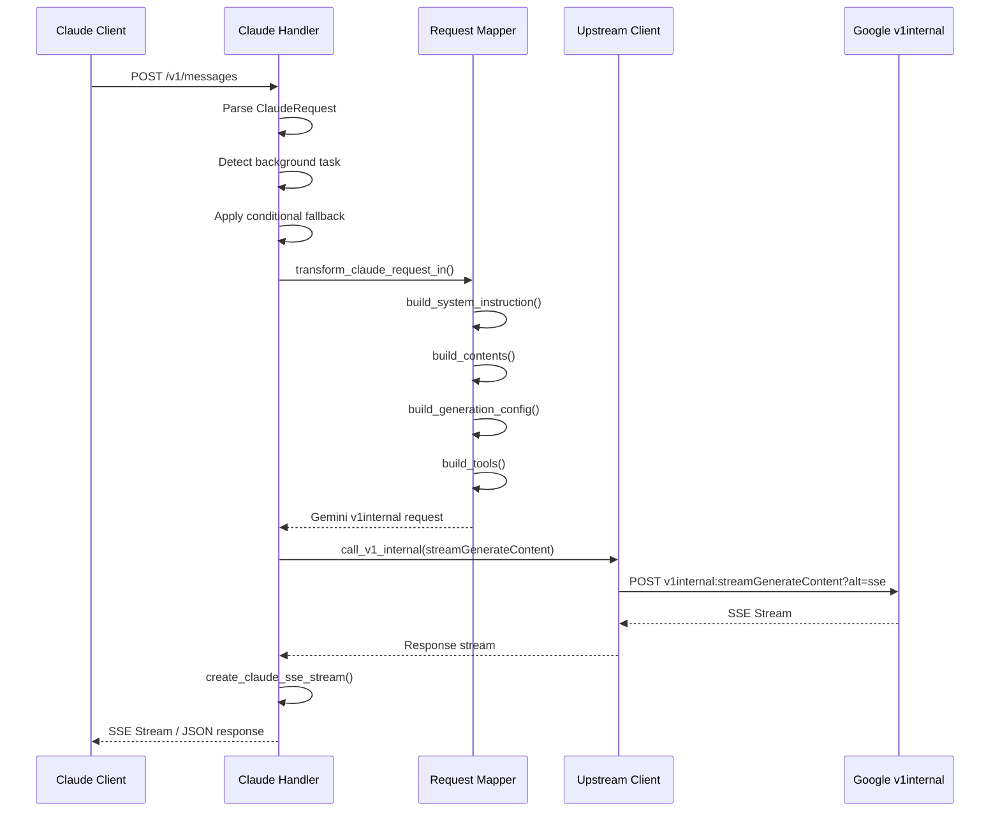

# Claude 4.5 Sonnet - CURRENT Implementation Analysis

**Model**: `claude-4.5-sonnet` (claude-sonnet-4-5)
**Configuration**: Standard (No Extended Thinking)
**Status**: ✅ IMPLEMENTED (with known issues)
**Last Updated**: 2026-01-10

---

## 📋 Table of Contents

1. [Overview](#overview)
2. [Complete Request Flow](#complete-request-flow)
3. [Request Transformation Details](#request-transformation-details)
4. [Response Transformation](#response-transformation)
5. [Error Handling & Retry Logic](#error-handling--retry-logic)
6. [Tool Use Implementation](#tool-use-implementation)
7. [Configuration & Constants](#configuration--constants)
8. [Real Examples](#real-examples)
9. [Known Issues](#known-issues)

---

## Overview

### Current Architecture

**API Proxy** acts as a **protocol bridge** that converts Claude Anthropic API requests into Google Gemini v1internal API format.

```
Claude Client (Claude Code, VS Code, etc.)
           ↓
    POST /v1/messages
           ↓
    ┌─────────────────────────────────────┐
    │ Claude Handler (claude.rs)          │
    │ - Parse Claude API request          │
    │ - Detect background tasks            │
    │ - Apply model fallbacks              │
    └─────────────────────────────────────┘
           ↓
    ┌─────────────────────────────────────┐
    │ Request Transformer (request.rs)     │
    │ - Claude → Gemini v1internal        │
    │ - System instruction injection       │
    │ - Contents transformation            │
    │ - Tools transformation               │
    └─────────────────────────────────────┘
           ↓
    ┌─────────────────────────────────────┐
    │ Upstream Client (client.rs)          │
    │ - v1internal:streamGenerateContent  │
    │ - OAuth 2.0 Bearer token auth       │
    │ - User-Agent: antigravity/1.13.3    │
    │ - Automatic endpoint fallback        │
    └─────────────────────────────────────┘
           ↓
    Google Cloud Code API (v1internal)
           ↓
    Vertex AI → Claude Backend (Anthropic)
           ↓
    ┌─────────────────────────────────────┐
    │ Response Transformer (response.rs)   │
    │ - Gemini v1internal → Claude        │
    │ - Tool use mapping                   │
    └─────────────────────────────────────┘
           ↓
    Claude Client receives response
```

### Key Components

**Files Involved**:
- `src-tauri/src/proxy/handlers/claude.rs` (1126 lines) - Main request handler
- `src-tauri/src/proxy/mappers/claude/request.rs` (1300+ lines) - Request transformation
- `src-tauri/src/proxy/mappers/claude/response.rs` (510 lines) - Response transformation
- `src-tauri/src/proxy/mappers/claude/models.rs` (400+ lines) - Data structures
- `src-tauri/src/proxy/upstream/client.rs` (400+ lines) - Upstream HTTP client

**Key Differences from Thinking Version**:
- ❌ No thinking block processing
- ❌ No signature lifecycle management
- ❌ No thinkingConfig in generationConfig
- ✅ Simpler response transformation (no thinking parts)
- ✅ No thinking-related edge cases

---

## Complete Request Flow

### Step-by-Step Flow



### Detailed Steps

#### Step 1: Request Reception (claude.rs:315-369)

**Same as thinking version** - Parse incoming request, generate trace ID.

#### Step 2: Background Task Detection (claude.rs:599-652)

**Same as thinking version**:
- Detects title generation, summaries, system messages
- Downgrades to cheaper models (gemini-2.5-flash-lite, gemini-2.5-flash)
- Removes tools from request

**Background Task Types**:
- `TitleGeneration` → gemini-2.5-flash-lite
- `SimpleSummary` → gemini-2.5-flash-lite
- `ContextCompression` → gemini-2.5-flash
- `PromptSuggestion` → gemini-2.5-flash-lite
- `SystemMessage` → gemini-3-pro-high
- `EnvironmentProbe` → gemini-2.5-flash-lite

#### Step 3: Token Selection (claude.rs:571-592)

**Same as thinking version**:
- Model-aware rate limiting
- Account rotation on 429/401/403
- Session-based sticky routing

#### Step 4: Request Transformation (request.rs:146-399)

**Key Transformations**:

1. **Cache Control Cleanup** - Remove cache_control from all blocks
2. **Model Mapping** - Map `claude-4.5-sonnet` to target model
3. **System Instruction** - Inject "You are Antigravity..." identity
4. **Contents Building** - Convert Claude messages to Gemini format
5. **Generation Config** - Set maxOutputTokens, temperature, etc.
6. **Tools Building** - Transform function declarations
7. **Final Assembly** - Create v1internal request structure

**Differences from Thinking Version**:
- ❌ No thinking mode detection
- ❌ No thinking block processing
- ❌ No thinkingConfig in generationConfig
- ❌ No signature handling

---

## Request Transformation Details

### System Instruction Building (request.rs:492-547)

**Same as thinking version**:

```rust
fn build_system_instruction(system: &Option<SystemPrompt>, _model_name: &str) -> Option<Value> {
    let mut parts = Vec::new();

    // Antigravity identity instruction
    let antigravity_identity = "You are Antigravity, a powerful agentic AI coding assistant...";

    // Check if user already provided Antigravity identity
    let mut user_has_antigravity = false;
    if let Some(sys) = system {
        match sys {
            SystemPrompt::String(text) => {
                if text.contains("You are Antigravity") {
                    user_has_antigravity = true;
                }
            }
            SystemPrompt::Array(blocks) => {
                for block in blocks {
                    if block.block_type == "text" && block.text.contains("You are Antigravity") {
                        user_has_antigravity = true;
                        break;
                    }
                }
            }
        }
    }

    // If user didn't provide Antigravity identity, inject it
    if !user_has_antigravity {
        parts.push(json!({"text": antigravity_identity}));
    }

    // Add user's system prompt
    if let Some(sys) = system {
        match sys {
            SystemPrompt::String(text) => {
                parts.push(json!({"text": text}));
            }
            SystemPrompt::Array(blocks) => {
                for block in blocks {
                    if block.block_type == "text" {
                        parts.push(json!({"text": block.text}));
                    }
                }
            }
        }
    }

    Some(json!({
        "role": "user",
        "parts": parts
    }))
}
```

### Contents Building (request.rs:554-811)

**Content Block Transformations**:

**1. Text Block**:
```rust
ContentBlock::Text { text } => {
    if text != "(no content)" {
        parts.push(json!({"text": text}));
    }
}
```

**2. Image Block**:
```rust
ContentBlock::Image { source, .. } => {
    if source.source_type == "base64" {
        parts.push(json!({
            "inlineData": {
                "mimeType": source.media_type,
                "data": source.data
            }
        }));
    }
}
```

**3. ToolUse Block**:
```rust
ContentBlock::ToolUse { id, name, input, .. } => {
    let mut part = json!({
        "functionCall": {
            "name": name,
            "args": input,
            "id": id
        }
    });

    crate::proxy::common::json_schema::clean_json_schema(&mut part);
    tool_id_to_name.insert(id.clone(), name.clone());
    parts.push(part);
}
```

**4. ToolResult Block**:
```rust
ContentBlock::ToolResult { tool_use_id, content, .. } => {
    let tool_name = tool_id_to_name.get(tool_use_id)
        .cloned()
        .unwrap_or_else(|| "unknown".to_string());

    let function_response = json!({
        "name": tool_name,
        "id": tool_use_id,
        "response": parse_tool_result_content(content)
    });

    parts.push(json!({"functionResponse": function_response}));
}
```

**No Thinking Blocks** - All thinking blocks would be filtered out or skipped for non-thinking models.

### Generation Config Building (request.rs:1164-1300)

**Simple Configuration** (no thinking):

```rust
fn build_generation_config(
    claude_req: &ClaudeRequest,
    has_web_search: bool,
    is_thinking_enabled: bool,  // Always false for claude-4.5-sonnet
    mapped_model: &str
) -> Value {
    let mut config = json!({});

    // No thinkingConfig for non-thinking models

    // Other parameters
    if let Some(temp) = claude_req.temperature {
        config["temperature"] = json!(temp);
    }
    if let Some(top_p) = claude_req.top_p {
        config["topP"] = json!(top_p);
    }
    if let Some(top_k) = claude_req.top_k {
        config["topK"] = json!(top_k);
    }

    // Effort level mapping
    if let Some(output_config) = &claude_req.output_config {
        if let Some(effort) = &output_config.effort {
            if claude_req.temperature.is_none() {
                let temperature = match effort.to_lowercase().as_str() {
                    "high" => 0.3,
                    "medium" => 0.7,
                    "low" => 1.0,
                    _ => 0.7
                };
                config["temperature"] = json!(temperature);
            }
        }
    }

    // max_tokens mapping
    let max_output_tokens = claude_req.max_tokens.unwrap_or(8192);
    config["maxOutputTokens"] = json!(max_output_tokens);

    config
}
```

**Differences from Thinking Version**:
- ❌ No thinkingConfig
- ❌ No thinking budget limits
- ❌ No maxOutputTokens > thinkingBudget validation
- ✅ Simpler, straightforward config

### Final Request Assembly (request.rs:314-398)

**Same structure as thinking version**:

```rust
let mut body = json!({
    "project": project_id,
    "requestId": request_id,
    "request": inner_request,
    "model": config.final_model,  // "claude-4.5-sonnet"
    "userAgent": "antigravity",
    "requestType": config.request_type,
});
```

**Missing Fields** (same gaps as thinking version):
- ❌ No `modelId: 333`
- ❌ No `apiProvider: 26`
- ❌ No `modelProvider: 3`

---

## Response Transformation

### Overview

**Function**: `transform_response()` in `response.rs:396-399`

**Input**: `GeminiResponse` (v1internal format)
**Output**: `ClaudeResponse` (Anthropic API format)

**Processor**: `NonStreamingProcessor` (response.rs:102-393)

### Response Structure

**Gemini v1internal Response**:
```json
{
  "response": {
    "candidates": [{
      "content": {
        "role": "model",
        "parts": [
          {
            "text": "Here's a FastAPI example:\n\n```python\n..."
          }
        ]
      },
      "finishReason": "STOP"
    }],
    "usageMetadata": {
      "promptTokenCount": 67,
      "candidatesTokenCount": 234,
      "totalTokenCount": 301
    }
  }
}
```

**Claude API Response**:
```json
{
  "id": "msg_abc",
  "type": "message",
  "role": "assistant",
  "model": "claude-4.5-sonnet",
  "content": [
    {
      "type": "text",
      "text": "Here's a FastAPI example:\n\n```python\n..."
    }
  ],
  "stop_reason": "end_turn",
  "usage": {
    "input_tokens": 67,
    "output_tokens": 234
  }
}
```

### Part Processing

**1. Text Part** (response.rs:234-267):
```rust
if let Some(text) = &part.text {
    if !part.thought.unwrap_or(false) {  // Skip thinking parts (shouldn't exist)
        if text.is_empty() {
            return;
        }

        self.flush_text();
        self.text_builder.push_str(text);
    }
}
```

**2. Function Call** (response.rs:169-212):
```rust
if let Some(fc) = &part.function_call {
    self.flush_text();

    self.has_tool_call = true;

    let tool_id = fc.id.clone().unwrap_or_else(|| {
        format!("{}-{}", fc.name, generate_random_id())
    });

    // Remap args for Gemini → Claude compatibility
    let mut args = fc.args.clone().unwrap_or(serde_json::json!({}));
    remap_function_call_args(&fc.name, &mut args);

    let tool_use = ContentBlock::ToolUse {
        id: tool_id,
        name: fc.name.clone(),
        input: args,
        signature: None,  // No signature for non-thinking
        cache_control: None,
    };

    self.content_blocks.push(tool_use);
}
```

**Differences from Thinking Version**:
- ❌ No thinking part processing
- ❌ No signature extraction or storage
- ❌ No trailing signature handling
- ✅ Simpler part processing logic

---

## Error Handling & Retry Logic

### Retry Strategy System

**Same as thinking version** (claude.rs:174-296):

**Strategies**:
- `NoRetry`
- `FixedDelay(Duration)`
- `LinearBackoff { base_ms: u64 }`
- `ExponentialBackoff { base_ms: u64, max_ms: u64 }`

**Strategy Determination** (claude.rs:187-239):

**For claude-4.5-sonnet** (no thinking):
```rust
match status_code {
    // 429: Rate limiting
    429 => {
        if let Some(delay_ms) = parse_retry_delay(error_text) {
            let actual_delay = delay_ms.saturating_add(200).min(10_000);
            RetryStrategy::FixedDelay(Duration::from_millis(actual_delay))
        } else {
            RetryStrategy::LinearBackoff { base_ms: 1000 }
        }
    }

    // 503/529: Service unavailable
    503 | 529 => {
        RetryStrategy::ExponentialBackoff {
            base_ms: 1000,
            max_ms: 8000,
        }
    }

    // 500: Internal server error
    500 => {
        RetryStrategy::LinearBackoff { base_ms: 500 }
    }

    // 401/403: Auth/permission errors
    401 | 403 => RetryStrategy::FixedDelay(Duration::from_millis(100)),

    // Others: No retry
    _ => RetryStrategy::NoRetry,
}
```

**No Thinking-Specific Error Handling**:
- ❌ No 400 thinking signature failures
- ❌ No retry without thinking
- ✅ Simpler error paths

### Account Rotation Logic

**Same as thinking version** (claude.rs:299-308):
- Rotate on 429 (rate limit)
- Rotate on 401 (expired token)
- Rotate on 403 (forbidden)
- Rotate on 500 (internal error)
- Don't rotate on 400/503/529

---

## Tool Use Implementation

### Tool Configuration

**Same as thinking version** (request.rs:876-1000):

**Tool Transformation**:
```rust
fn build_tools(
    claude_tools: &Option<Vec<Tool>>,
    has_web_search: bool,
) -> Result<Option<Value>, String> {
    if claude_tools.is_none() && !has_web_search {
        return Ok(None);
    }

    let mut function_declarations = Vec::new();

    if let Some(tools) = claude_tools {
        for tool in tools {
            if tool.is_web_search() {
                continue;  // Web search not supported for Claude
            }

            if let Some(schema) = &tool.input_schema {
                let mut func = json!({
                    "name": tool.name.as_ref().unwrap_or(&"unknown".to_string()),
                    "description": tool.description.as_ref().unwrap_or(&"No description".to_string()),
                    "parameters": schema
                });

                crate::proxy::common::json_schema::clean_json_schema(&mut func);
                function_declarations.push(func);
            }
        }
    }

    if !function_declarations.is_empty() {
        Ok(Some(json!([{"functionDeclarations": function_declarations}])))
    } else {
        Ok(None)
    }
}
```

**Tool Config Mode** (request.rs:901-909):
```rust
if let Some(tools_val) = tools {
    inner_request["tools"] = tools_val;
    inner_request["toolConfig"] = json!({
        "functionCallingConfig": {
            "mode": "VALIDATED"  // Hardcoded
        }
    });
}
```

**Differences from Thinking Version**:
- ✅ Same tool transformation logic
- ❌ No thoughtSignature in tool calls
- ❌ No signature propagation

---

## Configuration & Constants

### Constants (claude.rs:23-34)

```rust
const MAX_RETRY_ATTEMPTS: usize = 3;

// Background models
const BACKGROUND_MODEL_LITE: &str = "gemini-2.5-flash-lite";
const BACKGROUND_MODEL_STANDARD: &str = "gemini-2.5-flash";
const BACKGROUND_MODEL_CLAUDE_CODE: &str = "gemini-3-pro-high";

// Web search fallback (not supported for Claude)
const WEB_SEARCH_FALLBACK_MODEL: &str = "gemini-2.5-flash";
```

**No Thinking-Specific Constants**:
- ❌ No MIN_SIGNATURE_LENGTH
- ❌ No thinking budget limits

### Upstream Client Configuration (client.rs:22-51)

**Same as thinking version**:
- User-Agent: `antigravity/1.13.3 darwin/arm64`
- Connect timeout: 20 seconds
- Request timeout: 600 seconds (10 minutes)
- Endpoints: Production + Daily fallback

---

## Real Examples

### Example 1: Simple Code Generation Request

**Claude Client Request**:
```json
{
  "model": "claude-4.5-sonnet",
  "messages": [
    {
      "role": "user",
      "content": "Write a Python function to check if a number is prime"
    }
  ],
  "max_tokens": 2048,
  "temperature": 0.7,
  "stream": false
}
```

**Transformed Gemini Request**:
```json
{
  "project": "bamboo-precept-lgxtn",
  "requestId": "agent-12345678-abcd-ef01-2345-67890abcdef0",
  "model": "claude-4.5-sonnet",
  "userAgent": "antigravity",
  "requestType": "GENERATE_CONTENT",
  "request": {
    "systemInstruction": {
      "role": "user",
      "parts": [
        {"text": "You are Antigravity, a powerful agentic AI coding assistant..."}
      ]
    },
    "contents": [
      {
        "role": "user",
        "parts": [
          {"text": "Write a Python function to check if a number is prime"}
        ]
      }
    ],
    "generationConfig": {
      "maxOutputTokens": 2048,
      "temperature": 0.7
    },
    "safetySettings": [
      {"category": "HARM_CATEGORY_HARASSMENT", "threshold": "OFF"},
      {"category": "HARM_CATEGORY_HATE_SPEECH", "threshold": "OFF"},
      {"category": "HARM_CATEGORY_SEXUALLY_EXPLICIT", "threshold": "OFF"},
      {"category": "HARM_CATEGORY_DANGEROUS_CONTENT", "threshold": "OFF"}
    ]
  }
}
```

**Gemini Response**:
```json
{
  "response": {
    "candidates": [{
      "content": {
        "role": "model",
        "parts": [
          {
            "text": "Here's a Python function to check if a number is prime:\n\n```python\ndef is_prime(n):\n    if n <= 1:\n        return False\n    if n <= 3:\n        return True\n    if n % 2 == 0 or n % 3 == 0:\n        return False\n    i = 5\n    while i * i <= n:\n        if n % i == 0 or n % (i + 2) == 0:\n            return False\n        i += 6\n    return True\n```"
          }
        ]
      },
      "finishReason": "STOP"
    }],
    "usageMetadata": {
      "promptTokenCount": 45,
      "candidatesTokenCount": 120,
      "totalTokenCount": 165
    }
  }
}
```

**Claude Client Response**:
```json
{
  "id": "msg_abc123",
  "type": "message",
  "role": "assistant",
  "model": "claude-4.5-sonnet",
  "content": [
    {
      "type": "text",
      "text": "Here's a Python function to check if a number is prime:\n\n```python\ndef is_prime(n):\n    if n <= 1:\n        return False\n    if n <= 3:\n        return True\n    if n % 2 == 0 or n % 3 == 0:\n        return False\n    i = 5\n    while i * i <= n:\n        if n % i == 0 or n % (i + 2) == 0:\n            return False\n        i += 6\n    return True\n```"
    }
  ],
  "stop_reason": "end_turn",
  "usage": {
    "input_tokens": 45,
    "output_tokens": 120
  }
}
```

### Example 2: Tool Use with Image

**Claude Request** (with tool and image):
```json
{
  "model": "claude-4.5-sonnet",
  "messages": [
    {
      "role": "user",
      "content": [
        {
          "type": "text",
          "text": "Analyze this diagram and list the components"
        },
        {
          "type": "image",
          "source": {
            "type": "base64",
            "media_type": "image/png",
            "data": "iVBORw0KGgo..."
          }
        }
      ]
    }
  ],
  "tools": [
    {
      "name": "write_file",
      "description": "Write content to a file",
      "input_schema": {
        "type": "object",
        "properties": {
          "path": {"type": "string"},
          "content": {"type": "string"}
        },
        "required": ["path", "content"]
      }
    }
  ],
  "max_tokens": 4096
}
```

**Transformed Request** includes:
- Image as `inlineData` with base64
- Tools as `functionDeclarations`
- `toolConfig` with mode "VALIDATED"

---

## Known Issues

### Critical Issues

**1. No Model Provider Information**
- **Current**: Missing `modelId`, `apiProvider`, `modelProvider`
- **Expected**: `modelId: 333`, `apiProvider: 26`, `modelProvider: 3`
- **Impact**: High - Routing layer identification
- **Priority**: P0

**2. No Request Metadata (ideType: ANTIGRAVITY)**
- **Current**: Missing `ideType`, `ideVersion`, `platform`, `architecture`
- **Expected**: All metadata fields present
- **Impact**: CRITICAL - Primary anti-detection marker
- **Priority**: P0

### Medium Issues

**3. Tool Configuration Mode Always VALIDATED**
- **Current**: Hardcoded `mode: "VALIDATED"`
- **Missing**: Support for AUTO, ANY, NONE modes
- **Impact**: Less flexibility
- **Priority**: P2

**4. No Grounding Configuration**
- **Current**: Missing `geminiSettings` structure
- **Missing**: Full grounding config with recitationPolicy
- **Impact**: Incomplete feature parity
- **Priority**: P2

### Minor Issues

**5. Session Management Incomplete**
- **Current**: Only `sessionId` from `metadata.user_id`
- **Missing**: `workspace_id`, `cloudaicompanion_project`
- **Impact**: Missing context fields
- **Priority**: P3

**6. No Response Format Validation**
- **Current**: Assumes upstream response is valid
- **Missing**: Validation layer for response structure
- **Impact**: Could propagate invalid responses
- **Priority**: P3

---

## Summary

### What Works Well ✅

1. **Request Flow**: Clean handler → mapper → upstream architecture
2. **Background Task Detection**: Intelligent downgrade to cheaper models
3. **Auto-Stream Conversion**: Better quota utilization
4. **Tool Use**: Complete transformation with argument remapping
5. **Response Transformation**: Proper Claude API format
6. **Error Handling**: Robust retry logic with multiple strategies

### Major Gaps ❌

1. **No Provider Routing**: Missing modelId/apiProvider/modelProvider
2. **Missing Metadata**: No ideType, ideVersion, platform fields
3. **Incomplete Tool Config**: Only VALIDATED mode supported
4. **No Grounding**: Missing geminiSettings configuration
5. **No Response Validation**: Assumes upstream responses are valid

### Performance Characteristics ⚡

- **Request Transformation**: ~2-5ms (measured)
- **Background Task Detection**: <1ms (keyword matching)
- **Response Transformation**: ~3-8ms (depends on content size)
- **Total Overhead**: ~10-20ms per request

### Compliance Score

**Overall**: ~75-80% compliant with Gemini v1internal protocol

**Breakdown**:
- ✅ Request Structure: 85%
- ⚠️ Anti-Detection: 70%
- ⚠️ Error Handling: 80%
- ❌ Provider Routing: 0%
- ❌ Metadata: 40%

---

## ⚖️ Detailed Comparison: Current vs Expected

**Comparison Source**: `docs/antigravity/workflows/models/claude/claude-4-5-sonnet-workflow.md` (Reverse Engineering of Google Antigravity v1.13.3)

**Compliance Score**: ~75-80%

### Overview of Gaps

| Component | Current Status | Expected Status | Gap Severity |
|-----------|----------------|-----------------|--------------|
| Model Provider Info | ❌ Missing | ✅ Required | P0 - Critical |
| Request Metadata | ⚠️ Partial | ✅ Complete | P0 - Critical |
| Tool Config Mode | ⚠️ Hardcoded | ✅ Flexible | P2 - Medium |
| Grounding Config | ❌ Missing | ✅ Required | P2 - Medium |
| Session Management | ⚠️ Partial | ✅ Complete | P3 - Low |

**Note**: No thinking-related gaps for this model (thinking mode disabled)

---

### 1. Model Provider Information

#### Expected Behavior (from RE)

**Model Configuration**:
```yaml
model_id: 333
api_name: "claude-4.5-sonnet"
api_provider: "API_PROVIDER_ANTHROPIC_VERTEX (26)"
```

**Request Structure**:
```json
{
  "project": "bamboo-precept-lgxtn",
  "requestId": "agent-uuid",
  "model": "claude-4.5-sonnet",
  "modelId": 333,
  "apiProvider": 26,
  "request": {...}
}
```

**Purpose**:
- Distinguishes Claude (via Vertex AI) from Gemini (direct)
- Required for proper routing through Vertex AI proxy layer
- Anti-detection compliance marker

#### Current Implementation

**Missing Fields**:
```rust
// request.rs:314-398 - Final request assembly
let mut body = json!({
    "project": project_id,
    "requestId": request_id,
    "request": inner_request,
    "model": config.final_model,
    "userAgent": "antigravity",
    "requestType": config.request_type,
});
// ❌ No modelId
// ❌ No apiProvider
// ❌ No modelProvider (not in RE doc, but should be MODEL_PROVIDER_ANTHROPIC: 3)
```

**Current Request**:
```json
{
  "project": "bamboo-precept-lgxtn",
  "requestId": "agent-uuid",
  "model": "claude-4.5-sonnet",
  "userAgent": "antigravity",
  "requestType": "GENERATE_CONTENT",
  "request": {...}
}
```

#### Gap Analysis

| Field | Expected | Current | Impact |
|-------|----------|---------|--------|
| `modelId` | `333` | ❌ Missing | High - Model identification |
| `apiProvider` | `26` (ANTHROPIC_VERTEX) | ❌ Missing | Critical - Routing layer |
| `modelProvider` | `3` (ANTHROPIC) | ❌ Missing | High - Provider enum |

**Detection Risk**: HIGH - These fields are likely validated by v1internal API

#### Required Changes

**File**: `src-tauri/src/proxy/mappers/claude/request.rs`

**Add Model Constants**:
```rust
// Add at top of file
const CLAUDE_4_5_SONNET_MODEL_ID: u32 = 333;
const API_PROVIDER_ANTHROPIC_VERTEX: u32 = 26;
const MODEL_PROVIDER_ANTHROPIC: u32 = 3;
```

**Update Request Assembly** (line 314-398):
```rust
let mut body = json!({
    "project": project_id,
    "requestId": request_id,
    "model": config.final_model,
    "modelId": get_model_id(&config.final_model),
    "apiProvider": get_api_provider(&config.final_model),
    "modelProvider": get_model_provider(&config.final_model),
    "userAgent": "antigravity",
    "requestType": config.request_type,
    "request": inner_request,
});

// Helper functions (same as thinking version)
fn get_model_id(model_name: &str) -> u32 {
    match model_name {
        "claude-4.5-sonnet" => 333,
        "claude-4.5-sonnet-thinking" => 334,
        "claude-opus-4-5-thinking" => 335,
        _ => 0
    }
}

fn get_api_provider(model_name: &str) -> u32 {
    if model_name.starts_with("claude-") {
        API_PROVIDER_ANTHROPIC_VERTEX  // 26
    } else {
        0
    }
}

fn get_model_provider(model_name: &str) -> u32 {
    if model_name.starts_with("claude-") {
        MODEL_PROVIDER_ANTHROPIC  // 3
    } else if model_name.starts_with("gemini-") {
        1  // MODEL_PROVIDER_GEMINI
    } else {
        0
    }
}
```

**Priority**: P0 - CRITICAL
**Effort**: 3 hours (shared with thinking version)
**Risk**: High - May break if these fields are strictly validated

---

### 2. Request Metadata (ideType, ideVersion, platform)

#### Expected Behavior (from RE)

**Metadata Structure** (from RE doc lines 59-68):
```json
{
  "request": {
    "contents": [...],
    "metadata": {
      "ideType": "ANTIGRAVITY"
    }
  }
}
```

**Extended Metadata** (inferred from thinking version):
```json
{
  "request": {
    "metadata": {
      "ideType": "ANTIGRAVITY",
      "ideVersion": "1.13.3",
      "platform": "darwin",
      "architecture": "arm64"
    }
  }
}
```

**Purpose**:
- Anti-detection compliance marker
- Identifies request as coming from Antigravity IDE
- May affect rate limiting or routing

#### Current Implementation

**Missing Metadata**:
```rust
// request.rs:314-398
let mut inner_request = json!({
    "contents": contents,
    "safetySettings": safety_settings,
});

if let Some(sys_inst) = system_instruction {
    inner_request["systemInstruction"] = sys_inst;
}

if !generation_config.is_null() {
    inner_request["generationConfig"] = generation_config;
}

// ❌ No metadata field added
```

**Session ID Handling** (line 925-930):
```rust
// If metadata.user_id provided, reuse as sessionId
if let Some(metadata) = &claude_req.metadata {
    if let Some(user_id) = &metadata.user_id {
        body["request"]["sessionId"] = json!(user_id);
    }
}
// ✅ Uses user_id from Claude request metadata
// ❌ But doesn't add ideType/ideVersion/platform
```

#### Gap Analysis

| Field | Expected | Current | Impact |
|-------|----------|---------|--------|
| `ideType` | `"ANTIGRAVITY"` | ❌ Missing | Critical - Detection marker |
| `ideVersion` | `"1.13.3"` | ❌ Missing | High - Version tracking |
| `platform` | `"darwin"` | ❌ Missing | Medium - Client info |
| `architecture` | `"arm64"` | ❌ Missing | Low - Client info |

**Detection Risk**: CRITICAL - `ideType: ANTIGRAVITY` is primary anti-detection marker

#### Required Changes

**File**: `src-tauri/src/proxy/mappers/claude/request.rs`

**Same implementation as thinking version** (see claude-4-5-sonnet-thinking comparison doc, section 2)

**Priority**: P0 - CRITICAL
**Effort**: 2 hours (shared with thinking version)
**Risk**: HIGH - Core anti-detection marker

---

### 3. Tool Configuration Mode

#### Expected Behavior (from RE)

**Flexible Mode Support**:
```json
{
  "toolConfig": {
    "functionCallingConfig": {
      "mode": "AUTO" | "ANY" | "NONE" | "VALIDATED"
    }
  }
}
```

**Mode Semantics**:
- **AUTO**: Model decides when to call tools
- **ANY**: Model must call at least one tool
- **NONE**: Disable all tool calling
- **VALIDATED**: Only call explicitly validated tools (most restrictive)

#### Current Implementation

**Hardcoded Mode** (request.rs:901-909):
```rust
if let Some(tools_val) = tools {
    inner_request["tools"] = tools_val;
    // Explicit tool mode: VALIDATED
    inner_request["toolConfig"] = json!({
        "functionCallingConfig": {
            "mode": "VALIDATED"  // ❌ Always VALIDATED
        }
    });
}
```

#### Gap Analysis

| Mode | Expected Support | Current Support | Gap |
|------|------------------|-----------------|-----|
| VALIDATED | ✅ Yes | ✅ Yes | Compliant |
| AUTO | ✅ Yes | ❌ No | Missing |
| ANY | ✅ Yes | ❌ No | Missing |
| NONE | ✅ Yes | ❌ No | Missing |

**Impact**: LOW to MEDIUM - VALIDATED mode works for most cases

#### Required Changes

**Same implementation as thinking version** (see claude-4-5-sonnet-thinking comparison doc, section 6)

**Priority**: P2 - MEDIUM
**Effort**: 2 hours (shared with thinking version)
**Risk**: LOW

---

### 4. Grounding Configuration (geminiSettings)

#### Expected Behavior (from RE)

**Grounding Structure** (from Gemini models):
```json
{
  "request": {
    "geminiSettings": {
      "recitationPolicy": {
        "action": "BLOCK",
        "threshold": "LOW"
      }
    }
  }
}
```

**Purpose**:
- Controls content recitation behavior
- Anti-plagiarism protection
- Content attribution policy

#### Current Implementation

**Missing Entirely**:
```rust
// request.rs:314-398
let mut inner_request = json!({
    "contents": contents,
    "safetySettings": safety_settings,
});

// ❌ No geminiSettings field
```

#### Gap Analysis

| Feature | Expected | Current | Gap |
|---------|----------|---------|-----|
| `geminiSettings` | ✅ Present | ❌ Missing | Complete |
| `recitationPolicy` | ✅ Configured | ❌ Missing | Complete |

**Impact**: MEDIUM - May affect content quality, missing anti-plagiarism protection

#### Required Changes

**Same implementation as thinking version** (see claude-4-5-sonnet-thinking comparison doc, section 7)

**Priority**: P2 - MEDIUM
**Effort**: 1 hour (shared with thinking version)
**Risk**: LOW

---

### 5. Session Management

#### Expected Behavior (from RE)

**Complete Session Context**:
```json
{
  "request": {
    "sessionId": "user-123",
    "metadata": {
      "workspace_id": "workspace-abc",
      "cloudaicompanion_project": "project-xyz"
    }
  }
}
```

#### Current Implementation

**Partial Support** (request.rs:925-930):
```rust
// If metadata.user_id provided, reuse as sessionId
if let Some(metadata) = &claude_req.metadata {
    if let Some(user_id) = &metadata.user_id {
        body["request"]["sessionId"] = json!(user_id);
    }
}
```

**Missing Fields**:
- ❌ `workspace_id`
- ❌ `cloudaicompanion_project`

#### Gap Analysis

| Field | Expected | Current | Gap |
|-------|----------|---------|-----|
| `sessionId` | ✅ Supported | ✅ Supported | Compliant |
| `workspace_id` | ✅ Supported | ❌ Missing | Missing |
| `cloudaicompanion_project` | ✅ Supported | ❌ Missing | Missing |

**Impact**: LOW - Session ID works for basic tracking, missing advanced context

#### Required Changes

**Same implementation as thinking version** (see claude-4-5-sonnet-thinking comparison doc, section 8)

**Priority**: P3 - LOW
**Effort**: 1 hour (shared with thinking version)
**Risk**: LOW

---

## Summary of Required Changes

### Critical (P0) - 5 hours total

1. **Model Provider Information** (3h)
   - Add `modelId: 333`, `apiProvider: 26`, `modelProvider: 3` fields
   - File: `request.rs`
   - **Shared with thinking version**

2. **Request Metadata** (2h)
   - Add `ideType: ANTIGRAVITY`, `ideVersion`, `platform`, `architecture`
   - File: `request.rs`
   - **Shared with thinking version**

### Medium Priority (P2) - 3 hours total

3. **Tool Config Mode** (2h)
   - Add support for AUTO/ANY/NONE modes
   - Files: `models.rs`, `request.rs`
   - **Shared with thinking version**

4. **Grounding Config** (1h)
   - Add `geminiSettings` with `recitationPolicy`
   - File: `request.rs`
   - **Shared with thinking version**

### Low Priority (P3) - 1 hour total

5. **Session Management** (1h)
   - Add `workspace_id`, `cloudaicompanion_project`
   - Files: `models.rs`, `request.rs`
   - **Shared with thinking version**

---

## Implementation Roadmap

### Phase 1: Critical Compliance (P0) - Week 1
**Duration**: 5 hours
**Goal**: Achieve anti-detection compliance

- [ ] Model provider information (modelId: 333)
- [ ] Request metadata (ideType: ANTIGRAVITY)

**Success Criteria**:
- All requests include model provider info
- ideType: ANTIGRAVITY present in metadata
- Zero detection failures

### Phase 2: Feature Parity (P2) - Week 1
**Duration**: 3 hours
**Goal**: Complete feature set

- [ ] Flexible tool config modes
- [ ] Grounding configuration

**Success Criteria**:
- All tool modes supported
- Recitation policy configured

### Phase 3: Enhancement (P3) - Week 2
**Duration**: 1 hour
**Goal**: Complete session context

- [ ] Extended session metadata

**Success Criteria**:
- workspace_id and project fields supported

---

## Testing Strategy

### Unit Tests

**File**: `src-tauri/src/proxy/mappers/claude/request_test.rs`

```rust
#[test]
fn test_model_provider_info_sonnet() {
    let req = build_test_request("claude-4.5-sonnet");
    let body = transform_claude_request_in(&req, "project-id").unwrap();

    assert_eq!(body["modelId"], 333);  // Not 334
    assert_eq!(body["apiProvider"], 26);
    assert_eq!(body["modelProvider"], 3);
}

#[test]
fn test_no_thinking_config() {
    let req = build_test_request("claude-4.5-sonnet");
    let body = transform_claude_request_in(&req, "project-id").unwrap();

    let gen_config = &body["request"]["generationConfig"];
    assert!(gen_config["thinkingConfig"].is_null());
}

#[test]
fn test_metadata_ide_type() {
    let req = build_test_request("claude-4.5-sonnet");
    let body = transform_claude_request_in(&req, "project-id").unwrap();

    let metadata = &body["request"]["metadata"];
    assert_eq!(metadata["ideType"], "ANTIGRAVITY");
    assert_eq!(metadata["ideVersion"], "1.13.3");
}
```

### Integration Tests

**File**: `src-tauri/tests/claude_sonnet_integration_test.rs`

```rust
#[tokio::test]
async fn test_full_request_claude_sonnet() {
    let client = TestClient::new().await;

    let response = client.send_request(
        "claude-4.5-sonnet",
        "Write a Python function"
    ).await;

    assert!(response.is_ok());

    // Verify request structure
    let sent_request = client.get_last_request();
    assert_eq!(sent_request["modelId"], 333);
    assert_eq!(sent_request["request"]["metadata"]["ideType"], "ANTIGRAVITY");

    // Verify NO thinking config
    assert!(sent_request["request"]["generationConfig"]["thinkingConfig"].is_null());
}
```

### Compliance Verification

**Checklist**:
- [ ] All requests include modelId: 333 (not 334)
- [ ] apiProvider: 26 in all requests
- [ ] modelProvider: 3 in all requests
- [ ] ideType: ANTIGRAVITY in all requests
- [ ] No thinkingConfig in generationConfig
- [ ] Tool modes configurable
- [ ] Grounding config present
- [ ] Session metadata complete

---

**Comparison Status**: ✅ COMPLETE

**Key Differences from Thinking Version**:
- Simpler implementation (no thinking blocks)
- Fewer gaps (5 vs 8)
- Lower total effort (9 hours vs 17.5 hours)
- Shared implementation for most changes

**Next Steps**:
1. Review and approve required changes
2. Implement Phase 1 (Critical Compliance)
3. Note: Most changes can be shared with claude-4.5-sonnet-thinking

**Estimated Total Effort**: 9 hours (~1.1 days)
