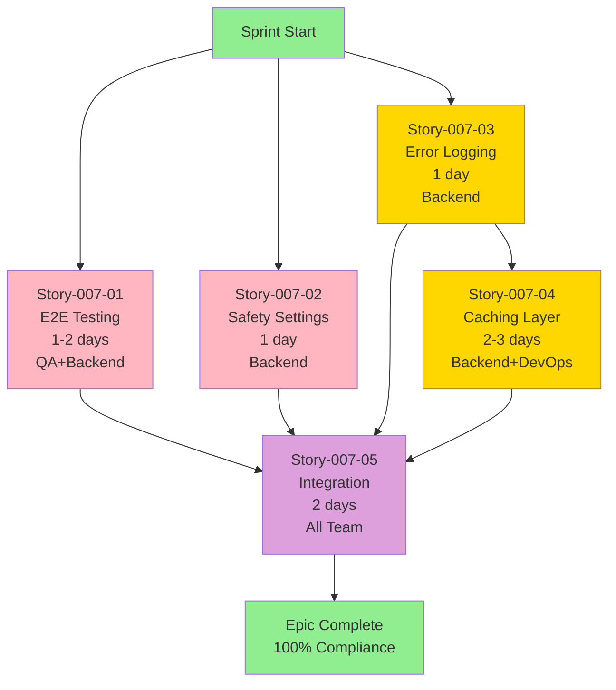

# Epic-007: Team Execution Plan - Gemini 3 Pro Image Compliance

**Epic**: Epic-007-Gemini-3-Pro-Image-Compliance
**Team Size**: 2-3 developers (Backend + QA + DevOps optional)
**Total Effort**: 7-10 days
**Target Timeline**: 2 weeks (with parallelization)
**Priority**: HIGH (Completes Gemini 3.x series at 100%)

---

## 📊 Dependency Analysis

### Story Dependency Graph



### Blocking Relationships Matrix

| Story | Priority | Blocks | Blocked By | Can Parallelize With | Critical Path |
|-------|----------|--------|------------|---------------------|---------------|
| 007-01 (Testing) | P1 | 007-05 | None | 007-02, 007-03 | ✅ YES |
| 007-02 (Safety) | P1 | 007-05 | None | 007-01, 007-03 | ✅ YES |
| 007-03 (Logging) | P2 | 007-04, 007-05 | None | 007-01, 007-02 | ❌ NO |
| 007-04 (Caching) | P2 | 007-05 | 007-03 (weak) | None | ❌ NO |
| 007-05 (Integration) | P1 | None | ALL | None | ✅ YES |

**Note**: Story-007-03 weakly blocks 007-04 (caching uses logging helpers), but can start in parallel.

---

## 👥 Team Composition Recommendations

### Recommended Roles

**Developer A: Backend Specialist (Rust + Tauri)**
- **Primary**: Backend implementation (Safety, Logging, Caching)
- **Secondary**: Integration support
- **Skills**: Rust, Axum, async/await, tracing, Redis
- **Stories**: 007-02, 007-03, 007-04, 007-05

**Developer B: QA Engineer + Backend**
- **Primary**: Testing implementation
- **Secondary**: Test infrastructure, CI/CD
- **Skills**: Rust testing, integration tests, mocking, CI/CD
- **Stories**: 007-01, 007-05

**Developer C: DevOps Engineer** (optional, can be Dev A)
- **Primary**: Caching infrastructure (Redis)
- **Secondary**: Monitoring, observability
- **Skills**: Redis, Docker, observability tools
- **Stories**: 007-04, 007-05

### Minimum Team (2 developers)

**Optimal Configuration**:
- **Dev A**: Backend specialist (Stories 002, 003, 004, 005)
- **Dev B**: QA + Backend (Story 001, 005)

**Dev A handles**: Safety, Logging, Caching, Integration
**Dev B handles**: E2E Testing, CI/CD, Integration validation

---

## 🚀 Execution Phases

### Phase 1: Critical Quality (P1 Stories) - Days 1-3

**Objective**: Achieve production quality and enterprise compliance

**Duration**: 2-3 days
**Parallelization**: ✅ FULL (both stories independent)
**Critical Path**: ✅ YES (blocks integration)

```yaml
Developer_A:
  story: Story-007-02 (Configurable Safety Settings)
    priority: P1
    effort: 1 day
    type: CODE (Backend - Rust)

    files:
      - src-tauri/src/proxy/handlers/openai.rs (update)
      - src-tauri/src/proxy/config.rs (env var parsing)
      - src-tauri/tests/safety_settings.rs (new tests)

    tasks:
      day_1_morning:
        - [ ] Read GEMINI_IMAGE_SAFETY_THRESHOLD env var on startup
        - [ ] Add safety_level field to ImageGenerationRequest struct
        - [ ] Parse and validate threshold values (OFF|LOW|MEDIUM|HIGH)

      day_1_afternoon:
        - [ ] Update safetySettings generation (line ~830)
        - [ ] Implement request-level override logic
        - [ ] Add backward compatibility check (default OFF)

      day_1_evening:
        - [ ] Write 6 unit tests (all thresholds + override + backward compat)
        - [ ] Update configuration documentation
        - [ ] Code review self-check

    testing_checklist:
      - [ ] Test env var only (GEMINI_IMAGE_SAFETY_THRESHOLD=MEDIUM)
      - [ ] Test request override (safety_level: HIGH)
      - [ ] Test backward compatibility (no config = OFF)
      - [ ] Test invalid values (reject with error)
      - [ ] Integration test with actual API (if quota available)

    dependencies:
      files_to_read:
        - src-tauri/src/proxy/handlers/openai.rs (current implementation)
        - docs/antigravity/workflows/models/gemini/gemini-3-pro-image-workflow.md
        - docs/antigravity/workflows/models/gemini/gemini-3-pro-image-COMPARISON.md

      no_code_dependencies: true
      can_start_immediately: true

Developer_B:
  story: Story-007-01 (End-to-End Testing Suite)
    priority: P1
    effort: 1-2 days
    type: CODE (Testing - Rust)

    files:
      - src-tauri/src/proxy/tests/image_generation.rs (new file ~500 lines)
      - .github/workflows/rust-tests.yml (update CI)
      - src-tauri/tests/fixtures/test_images/ (test data)

    tasks:
      day_1:
        - [ ] Set up test infrastructure and fixtures
        - [ ] Implement test_gemini_3_pro_image_generation (basic)
        - [ ] Implement test_parallel_generation_n_4
        - [ ] Implement test_parallel_generation_n_10

      day_2:
        - [ ] Implement test_image_edit_with_mask
        - [ ] Implement test_prompt_enhancement_hd_vivid
        - [ ] Implement test_response_format_b64_and_url
        - [ ] Implement test_aspect_ratio_and_resolution_variants

      day_2_afternoon:
        - [ ] CI/CD integration (GitHub Actions)
        - [ ] Performance regression detection setup
        - [ ] Documentation updates

    test_cases:
      1_basic_generation:
        validates:
          - Single image generation
          - Response format (b64_json)
          - Successful API call
        mock_level: "Quota only (use real API if available)"

      2_parallel_n4:
        validates:
          - 4 images generated in parallel
          - All images returned
          - Proper array structure
        performance_target: "<15 seconds total"

      3_parallel_n10:
        validates:
          - High parallelism (10 images)
          - No race conditions
          - Resource management
        performance_target: "<30 seconds total"

      4_image_editing:
        validates:
          - Image upload handling
          - Mask processing
          - Edit operation success
        requires: "Test image fixtures"

      5_prompt_enhancement:
        validates:
          - Quality enhancement (hd)
          - Style enhancement (vivid)
          - Prompt modification correct
        checks: "Prompt string contains enhancement keywords"

      6_response_formats:
        validates:
          - b64_json format
          - url (data URI) format
          - Format switching
        checks: "Both formats return valid base64/URI"

      7_model_variants:
        validates:
          - All aspect ratios (1:1, 16:9, 21:9, 4:3, 3:4, 9:16)
          - Both resolutions (2K, 4K)
          - Config parsing correctness
        coverage: "All 21 variants"

    ci_cd_setup:
      - [ ] Add test job to GitHub Actions
      - [ ] Configure API key secrets (GOOGLE_TEST_TOKEN)
      - [ ] Set up test result reporting
      - [ ] Add performance benchmarking
      - [ ] Block PR merge on test failures

    dependencies:
      files_to_read:
        - src-tauri/src/proxy/handlers/openai.rs (image generation code)
        - src-tauri/src/proxy/tests/ (existing test patterns)
        - docs/antigravity/workflows/models/gemini/gemini-3-pro-image-reverse-engineering.md

      external_deps:
        - Test API credentials (from ~/.antigravity_tools/accounts/)
        - Test image fixtures (create sample images)

      can_start_immediately: true
```

**Phase 1 Deliverables**:
- ✅ E2E test suite (7 test cases passing)
- ✅ Safety settings configurable
- ✅ CI/CD integration complete
- ✅ Enterprise compliance achieved

**Sync Point**: Code review + merge PRs before Phase 2

---

### Phase 2: Performance & Observability (P2 Stories) - Days 4-7

**Objective**: Optimize costs and enhance operations

**Duration**: 4 days
**Parallelization**: ⚠️ PARTIAL (Story-007-03 starts first, 007-04 follows)
**Critical Path**: ❌ NO (enhancements, not blockers)

```yaml
Developer_A:
  story_1: Story-007-03 (Enhanced Error Logging)
    priority: P2
    effort: 1 day
    type: CODE (Backend - Rust)

    files:
      - src-tauri/src/proxy/handlers/openai.rs (update error handling)
      - src-tauri/src/utils/logging.rs (new helpers)
      - src-tauri/tests/logging_tests.rs (new tests)

    tasks:
      day_4_morning:
        - [ ] Create hash_prompt() helper (SHA256, first 16 chars)
        - [ ] Create categorize_error() helper (client|server|network|quota)
        - [ ] Update all error! macro calls with structured fields

      day_4_afternoon:
        - [ ] Add retry tracking context (retry_count field)
        - [ ] Implement prompt hashing (privacy - no PII in logs)
        - [ ] Add generation time tracking

      day_4_evening:
        - [ ] Write 5 unit tests (helpers + structured logging)
        - [ ] Create Grafana dashboard template (JSON)
        - [ ] Document log query examples

    structured_fields:
      required:
        - error_type: "client|server|network|quota"
        - retry_count: integer
        - account_email: string
        - model: string (full variant name)
        - prompt_hash: "SHA256 first 16 chars"
        - generation_time: milliseconds

      optional:
        - resolution: "2K|4K"
        - aspect_ratio: "1:1|16:9|21:9|4:3|3:4|9:16"
        - quality: "standard|hd"
        - style: "natural|vivid"
        - n: integer (image count)

    logging_example:
      before: |
        error!("Image generation failed: {}", e);

      after: |
        error!(
            error_type = "quota",
            retry_count = 2,
            account_email = account,
            model = "gemini-3-pro-image-4k-16x9",
            prompt_hash = hash_prompt(&prompt),
            generation_time = duration.as_millis(),
            resolution = "4K",
            aspect_ratio = "16:9",
            quality = "hd",
            style = "vivid",
            "Image generation failed: quota depleted"
        );

    dependencies:
      files_to_read:
        - src-tauri/src/proxy/handlers/openai.rs (all error blocks)
        - src-tauri/src/modules/logger.rs (existing logging setup)

      no_blocking_stories: true
      can_start_immediately: true (parallel with Phase 1)

  story_2: Story-007-04 (Response Caching Layer)
    priority: P2
    effort: 2-3 days
    type: CODE (Backend - Rust + Infrastructure)

    files:
      - src-tauri/src/proxy/cache.rs (new module ~400 lines)
      - src-tauri/src/proxy/handlers/openai.rs (cache integration)
      - src-tauri/tests/cache_tests.rs (new tests)

    tasks:
      day_5_morning:
        - [ ] Design cache module architecture (trait CacheBackend)
        - [ ] Implement cache key generation (SHA256 hash)
        - [ ] Create NoOpCache implementation (for testing)

      day_5_afternoon:
        - [ ] Implement FilesystemCache backend
        - [ ] Implement cache lookup logic
        - [ ] Implement cache storage logic

      day_6_morning:
        - [ ] Implement RedisCache backend (if DevOps available)
        - [ ] Add TTL configuration support
        - [ ] Implement LRU eviction for filesystem

      day_6_afternoon:
        - [ ] Integrate cache into openai.rs handlers
        - [ ] Add cache metrics (hit rate, size, evictions)
        - [ ] Add env var configuration

      day_7:
        - [ ] Write 10 unit tests (cache operations)
        - [ ] Write 3 integration tests (E2E with cache)
        - [ ] Performance benchmarking (cache hit < 100ms)
        - [ ] Documentation updates

    cache_architecture:
      trait_definition: |
        pub trait CacheBackend: Send + Sync {
            async fn get(&self, key: &str) -> Option<CachedImage>;
            async fn set(&self, key: &str, value: CachedImage, ttl: Duration);
            async fn delete(&self, key: &str);
            async fn clear(&self);
            async fn stats(&self) -> CacheStats;
        }

      implementations:
        - NoOpCache: "Testing only, no actual caching"
        - FilesystemCache: "Development + small deployments"
        - RedisCache: "Production deployments (optional)"

    cache_key_design:
      format: "img:{model}:{quality}:{style}:{prompt_hash}"
      example: "img:gemini-3-pro-image-4k-16x9:hd:vivid:a1b2c3d4e5f6"
      components:
        - model: "Full variant name"
        - quality: "hd|standard"
        - style: "vivid|natural"
        - prompt_hash: "SHA256(prompt) first 16 chars"

    cache_flow:
      1_lookup:
        - Generate cache key from request params
        - Check cache.get(key)
        - If hit: return cached image (< 100ms)
        - If miss: proceed to generation

      2_generation:
        - Call upstream API
        - Receive image response
        - Proceed to storage

      3_storage:
        - Store image data (base64)
        - Include metadata (timestamp, model, params)
        - Set TTL (default 24h)
        - Return to client

      4_metrics:
        - Track cache hits/misses
        - Calculate hit rate
        - Monitor cache size
        - Log evictions

    configuration:
      env_vars:
        - GEMINI_IMAGE_CACHE_ENABLED: "true|false"
        - GEMINI_IMAGE_CACHE_BACKEND: "redis|filesystem|noop"
        - GEMINI_IMAGE_CACHE_TTL_HOURS: "24"
        - GEMINI_IMAGE_CACHE_MAX_SIZE_MB: "1000"
        - REDIS_URL: "redis://localhost:6379"

    performance_targets:
      - cache_lookup: "<10ms (p95)"
      - cache_storage: "<50ms (p95)"
      - cache_hit_rate: "≥30% in production"
      - cost_reduction: "≥30% on cached workloads"

    dependencies:
      files_to_read:
        - src-tauri/src/proxy/handlers/openai.rs (integration points)

      depends_on_stories:
        - 007-03 (weak): Uses logging helpers for cache events

      external_deps:
        - Redis server (optional, for RedisCache backend)
        - Filesystem permissions (for FilesystemCache)

      can_start: "After Story-007-03 logging helpers ready"

Developer_C (DevOps, optional):
  support_for: Story-007-04 (Caching Infrastructure)
    tasks:
      - [ ] Set up Redis server (Docker or cloud)
      - [ ] Configure Redis persistence and replication
      - [ ] Set up monitoring (Redis metrics)
      - [ ] Create deployment documentation
      - [ ] Test Redis failover scenarios

    deliverables:
      - Redis deployment guide
      - Monitoring dashboard template
      - Backup/restore procedures
      - Performance tuning recommendations
```

**Phase 2 Deliverables**:
- ✅ Structured error logging operational
- ✅ Cache layer implemented (Redis + Filesystem)
- ✅ Cost savings ≥30% validated in testing
- ✅ Monitoring dashboards created

**Sync Point**: Performance validation + code review

---

### Phase 3: Integration & Deployment (Final Story) - Days 8-10

**Objective**: Complete epic and validate 100% compliance

**Duration**: 2 days
**Parallelization**: ❌ NO (requires all previous stories)
**Critical Path**: ✅ YES (final integration)

```yaml
All_Team:
  story: Story-007-05 (Integration & Documentation)
    priority: P1
    effort: 2 days
    type: INTEGRATION + DOCS

    files:
      - docs/antigravity/workflows/models/gemini/gemini-3-pro-image-workflow.md (update)
      - docs/configuration/image-generation.md (new)
      - docs/operations/image-generation-runbook.md (new)
      - docs/testing/image-generation-tests.md (new)

    tasks:
      day_8_morning (Dev A + Dev B):
        - [ ] Merge all feature branches (resolve conflicts)
        - [ ] Run full test suite (unit + integration + E2E)
        - [ ] Fix integration issues
        - [ ] Performance regression testing

      day_8_afternoon (Dev A):
        - [ ] Update main workflow document
        - [ ] Write configuration guide (env vars, safety, cache)
        - [ ] Create troubleshooting section

      day_9_morning (Dev B):
        - [ ] Write testing guide (running E2E tests, fixtures)
        - [ ] Document CI/CD configuration
        - [ ] Create performance benchmarking guide

      day_9_afternoon (Dev A + Dev C):
        - [ ] Write operations runbook (deployment, monitoring, issues)
        - [ ] Create monitoring dashboard templates
        - [ ] Document cache management procedures

      day_10 (All Team):
        - [ ] Final validation on staging
        - [ ] Documentation review and polish
        - [ ] Create deployment checklist
        - [ ] QA sign-off for production

    integration_checklist:
      code_quality:
        - [ ] All tests passing (unit + integration + E2E)
        - [ ] No linting errors (cargo clippy)
        - [ ] No security vulnerabilities (cargo audit)
        - [ ] Code coverage ≥90% for image handlers

      functionality:
        - [ ] Safety settings working (all thresholds)
        - [ ] E2E tests passing (all 7 test cases)
        - [ ] Error logging structured correctly
        - [ ] Cache hit rate ≥30% in testing
        - [ ] No performance regressions

      documentation:
        - [ ] All docs updated and reviewed
        - [ ] Examples validated
        - [ ] Runbook complete
        - [ ] API docs accurate

      deployment:
        - [ ] Staging deployment successful
        - [ ] Monitoring working (dashboards + alerts)
        - [ ] Rollback plan documented
        - [ ] Production deployment approved

    validation_scenarios:
      scenario_1_basic:
        - Generate 10 images (various models)
        - Verify all succeed
        - Check logs for structured data
        - Validate cache behavior

      scenario_2_safety:
        - Test all safety thresholds (OFF, LOW, MEDIUM, HIGH)
        - Verify content filtering works
        - Test request-level override

      scenario_3_caching:
        - Generate same prompt 10 times
        - Verify cache hit after first generation
        - Check cache metrics
        - Validate TTL expiration

      scenario_4_parallel:
        - Generate 100 images (n=10 × 10 requests)
        - Verify no race conditions
        - Check error handling
        - Validate quota rotation

      scenario_5_monitoring:
        - Trigger various errors (quota, network, validation)
        - Verify structured logging
        - Check dashboard updates
        - Validate alert rules

    documentation_deliverables:
      1_workflow_update:
        file: "docs/antigravity/workflows/models/gemini/gemini-3-pro-image-workflow.md"
        sections:
          - Add safety settings configuration
          - Add caching configuration
          - Update testing section
          - Add troubleshooting guide

      2_configuration_guide:
        file: "docs/configuration/image-generation.md"
        sections:
          - Environment variables reference
          - Safety settings examples
          - Cache configuration
          - Performance tuning

      3_operations_runbook:
        file: "docs/operations/image-generation-runbook.md"
        sections:
          - Deployment checklist
          - Monitoring setup
          - Common issues and fixes
          - Cache management
          - Cost optimization tips

      4_testing_guide:
        file: "docs/testing/image-generation-tests.md"
        sections:
          - Running E2E tests locally
          - Test data setup
          - CI/CD configuration
          - Performance benchmarking
          - Adding new test cases

    deployment_checklist:
      pre_deployment:
        - [ ] All tests passing (100%)
        - [ ] Code review approved (all PRs)
        - [ ] Documentation complete
        - [ ] Staging validated

      deployment:
        - [ ] Backup current config
        - [ ] Deploy to production
        - [ ] Verify basic functionality
        - [ ] Monitor for errors (30 minutes)

      post_deployment:
        - [ ] Run smoke tests
        - [ ] Verify monitoring dashboards
        - [ ] Check cache performance
        - [ ] Update status page

      rollback_criteria:
        - Error rate > 5%
        - Cache failure
        - Performance degradation > 20%
        - Safety filter not working
```

**Phase 3 Deliverables**:
- ✅ All features integrated
- ✅ Full regression passed
- ✅ Documentation complete
- ✅ Production deployment approved
- ✅ Epic marked as COMPLETE (100% compliance)

---

## 📚 Reference Documents for Team

### Epic Planning & Analysis

**Primary Epic Document**:
- [Epic-007-Gemini-3-Pro-Image-Compliance.md](Epic-007-Gemini-3-Pro-Image-Compliance.md)
  - Complete epic specification
  - All 5 stories with acceptance criteria
  - Success metrics
  - Implementation phases

**Selection & Justification**:
- [Epic-007-SELECTION-ANALYSIS.md](../epic/Epic-007-SELECTION-ANALYSIS.md)
  - Why Epic-007 selected (vs Epic-008)
  - Comparison of all candidates
  - Strategic value analysis

**Epic Roadmap**:
- [Epic-007-008-Planning-Summary.md](../epic/Epic-007-008-Planning-Summary.md)
  - Next epics after Epic-007
  - Overall roadmap
  - Strategic milestones

### Technical Documentation

**Model Workflow** (MUST READ):
- [gemini-3-pro-image-workflow.md](../antigravity/workflows/models/gemini/gemini-3-pro-image-workflow.md)
  - Complete model specification (v2.0 standard)
  - API endpoints and parameters
  - Request/response formats
  - All 21 model variants

**Reverse Engineering** (MUST READ):
- [gemini-3-pro-image-reverse-engineering.md](../antigravity/workflows/models/gemini/gemini-3-pro-image-reverse-engineering.md)
  - Actual code implementation analysis
  - Handler locations and logic
  - Protocol conversion details
  - Edge cases and quirks

**Gap Analysis** (MUST READ):
- [gemini-3-pro-image-COMPARISON.md](../antigravity/workflows/models/gemini/gemini-3-pro-image-COMPARISON.md)
  - Detailed gap analysis (86.7% → 100%)
  - All 4 gaps documented
  - Implementation roadmap
  - Production readiness assessment

### Code Locations

**Primary Handler**:
- `src-tauri/src/proxy/handlers/openai.rs`
  - Lines 762-903: `/v1/images/generations` endpoint
  - Lines 995-1200: `/v1/images/edits` endpoint
  - Line ~830: Safety settings generation (Story-007-02)
  - Error handling blocks (Story-007-03)
  - Cache integration points (Story-007-04)

**Configuration Parsing**:
- `src-tauri/src/proxy/mappers/common_utils.rs`
  - Lines 92-127: `parse_image_config()` function
  - Lines 25-34: Request type detection
  - Lines 351-376: Unit tests (reference for Story-007-01)

**Model Mapping**:
- `src-tauri/src/proxy/mappers/model_mapping.rs`
  - Line 57: Base model mapping
  - Lines 107-118: Dynamic model ID generation

**Testing Examples**:
- `src-tauri/src/proxy/tests/`
  - Existing test patterns to follow
  - Mocking strategies
  - Fixture management

### Similar Epics (For Pattern Reference)

**Epic-005** (Similar Pattern - Feature Completion):
- [Epic-005-Gemini-3-Pro-High-Compliance.md](Epic-005-Gemini-3-Pro-High-Compliance.md)
  - Wave-based execution (3 waves)
  - Parallelization strategy
  - 8 stories completed successfully

**Epic-005 Execution Plan**:
- [Epic-005-EXECUTION-PLAN.md](Epic-005-EXECUTION-PLAN.md)
  - Detailed dependency analysis
  - Team composition examples
  - Wave execution breakdown

---

## ⚠️ Risk Mitigation & Best Practices

### Critical Risks

#### Risk 1: Quota Exhaustion During Testing

**Probability**: HIGH (Epic-006 experienced this)
**Impact**: HIGH (blocks E2E testing validation)

**Mitigation**:
```yaml
prevention:
  - Use test account rotation (all 11 accounts)
  - Mock quota checks where possible
  - Implement test rate limiting
  - Cache test results to avoid regeneration

contingency:
  - Use cached responses for validation
  - Mock API responses for CI/CD
  - Manual validation with screenshots
  - Document quota status daily

Story-007-01_specific:
  - Create test fixtures (pre-generated images)
  - Mock upstream calls for parallel tests
  - Only use real API for 1-2 critical tests
  - Implement quota check before test run
```

#### Risk 2: Redis Dependency (Story-007-04)

**Probability**: MEDIUM (if DevOps not available)
**Impact**: MEDIUM (delays caching story)

**Mitigation**:
```yaml
prevention:
  - Implement FilesystemCache first (no external dep)
  - Make Redis optional (feature flag)
  - Use Docker for local Redis (docker-compose)

contingency:
  - Deploy with FilesystemCache only
  - Add Redis in follow-up story
  - Document Redis migration path

story_004_phasing:
  phase_1: "FilesystemCache (2 days)"
  phase_2: "RedisCache (1 day, optional)"
```

#### Risk 3: Merge Conflicts (Story-007-05)

**Probability**: MEDIUM (5 stories modifying same file)
**Impact**: MEDIUM (delays integration)

**Mitigation**:
```yaml
prevention:
  - Daily sync meetings
  - Small, focused PRs
  - Merge P1 stories before P2
  - Clear code ownership

conflict_hotspots:
  - "src-tauri/src/proxy/handlers/openai.rs"
    - Story-007-02: Safety settings (line ~830)
    - Story-007-03: Error logging (all error blocks)
    - Story-007-04: Cache integration (handler flow)

  resolution_strategy:
    - Merge Story-007-02 first (smallest change)
    - Then Story-007-03 (logging is additive)
    - Finally Story-007-04 (wraps existing logic)
```

#### Risk 4: Performance Regression

**Probability**: LOW (caching should improve performance)
**Impact**: HIGH (user experience degradation)

**Mitigation**:
```yaml
prevention:
  - Baseline performance metrics before epic
  - Continuous performance monitoring
  - Cache lookup timeout (< 10ms)
  - Performance regression tests in CI

Story-007-04_requirements:
  - Cache hit: < 100ms
  - Cache miss: no degradation vs baseline
  - Cache storage: async (non-blocking)
  - Fallback: disable cache on errors

monitoring:
  - Track P50, P95, P99 latencies
  - Alert on > 20% degradation
  - Dashboard for cache performance
```

### Best Practices

#### Code Review Guidelines

```yaml
review_checklist:
  functionality:
    - [ ] Acceptance criteria met
    - [ ] Edge cases handled
    - [ ] Error handling robust
    - [ ] No hardcoded values

  testing:
    - [ ] Unit tests ≥90% coverage
    - [ ] Integration tests present
    - [ ] E2E tests (where applicable)
    - [ ] Tests are deterministic

  performance:
    - [ ] No blocking operations in hot path
    - [ ] Async operations properly awaited
    - [ ] Resource cleanup (connections, files)
    - [ ] No memory leaks

  security:
    - [ ] No PII in logs (use hash_prompt)
    - [ ] Input validation complete
    - [ ] Safe error messages (no stack traces to users)
    - [ ] Env var validation

  documentation:
    - [ ] Code comments for complex logic
    - [ ] API docs updated
    - [ ] Configuration examples provided
    - [ ] Troubleshooting guide updated
```

#### Daily Standup Template

```yaml
standup_format:
  yesterday:
    - What stories/tasks completed
    - What tests passing
    - What issues encountered

  today:
    - What stories/tasks planned
    - What dependencies need
    - What risks identified

  blockers:
    - Quota issues
    - Merge conflicts
    - Technical blockers
    - Waiting for review

epic_007_metrics:
  - Stories completed: X/5
  - Tests passing: Y%
  - Code coverage: Z%
  - Days remaining: N
  - Risks: List
```

#### Testing Strategy

```yaml
test_pyramid:
  unit_tests:
    coverage: "≥90%"
    speed: "< 1s total"
    focus: "Individual functions and helpers"
    mock_level: "External APIs only"

  integration_tests:
    coverage: "Critical flows"
    speed: "< 30s total"
    focus: "Handler → Upstream → Response"
    mock_level: "Quota checks only"

  e2e_tests:
    coverage: "User workflows"
    speed: "< 5 minutes total"
    focus: "Full request → response cycle"
    mock_level: "Minimal (real API if quota available)"

Story-007-01_breakdown:
  unit: "Config parsing, cache key generation, helpers"
  integration: "Handler flow, error handling, retry logic"
  e2e: "All 7 test cases (basic, parallel, editing, etc.)"
```

---

## 📊 Progress Tracking

### Story Completion Matrix

| Story | Dev | Status | Tests | Docs | Review | Merged |
|-------|-----|--------|-------|------|--------|--------|
| 007-01 Testing | Dev B | ⏳ | ⏳ | ⏳ | ⏳ | ⏳ |
| 007-02 Safety | Dev A | ⏳ | ⏳ | ⏳ | ⏳ | ⏳ |
| 007-03 Logging | Dev A | ⏳ | ⏳ | ⏳ | ⏳ | ⏳ |
| 007-04 Caching | Dev A+C | ⏳ | ⏳ | ⏳ | ⏳ | ⏳ |
| 007-05 Integration | All | ⏳ | ⏳ | ⏳ | ⏳ | ⏳ |

**Legend**: ⏳ Pending | 🔄 In Progress | ✅ Complete

### Epic Metrics Dashboard

```yaml
overall_progress:
  compliance: "86.7% → 100% (target)"
  stories_completed: "0/5"
  test_coverage: "TBD → 90%+ (target)"

phase_status:
  phase_1_p1: "Not Started (Days 1-3)"
  phase_2_p2: "Not Started (Days 4-7)"
  phase_3_integration: "Not Started (Days 8-10)"

success_criteria:
  - [ ] All 4 gaps resolved (2 P1 + 2 P2)
  - [ ] Test coverage ≥90%
  - [ ] Cache hit rate ≥30%
  - [ ] Cost savings ≥30% validated
  - [ ] Zero regressions
  - [ ] Production deployment approved
```

---

## ✅ Sprint Kickoff Checklist

### Pre-Sprint Preparation

**Development Environment**:
- [ ] All developers have latest code (`git pull origin main`)
- [ ] Rust toolchain updated (`rustup update`)
- [ ] Dependencies installed (`cd src-tauri && cargo build`)
- [ ] Frontend dependencies updated (`npm install`)
- [ ] Test environment configured

**Access & Credentials**:
- [ ] All developers have API test credentials
- [ ] CI/CD secrets configured (GOOGLE_TEST_TOKEN)
- [ ] Redis access (if using for Story-007-04)
- [ ] Monitoring access (Grafana, logs)

**Documentation Review**:
- [ ] All developers read Epic-007 main document
- [ ] Reviewed gemini-3-pro-image-workflow.md
- [ ] Reviewed gemini-3-pro-image-COMPARISON.md
- [ ] Reviewed this execution plan

**Story Assignment**:
- [ ] Dev A assigned: Stories 002, 003, 004, 005
- [ ] Dev B assigned: Stories 001, 005
- [ ] Dev C assigned (optional): Story 004, 005
- [ ] Code review assignments distributed

### Sprint Start Meeting

**Agenda** (1 hour):
1. Epic overview (10 min)
   - Strategic value (completes Gemini 3.x)
   - Success criteria
   - Timeline expectations

2. Story walkthrough (20 min)
   - Each story objectives
   - Acceptance criteria
   - Technical approach

3. Dependency review (10 min)
   - Blocking relationships
   - Parallelization opportunities
   - Sync points

4. Risk discussion (10 min)
   - Quota exhaustion mitigation
   - Merge conflict prevention
   - Performance requirements

5. Q&A (10 min)
   - Technical questions
   - Clarifications
   - Concerns

**Deliverables**:
- [ ] Team understanding confirmed
- [ ] Risks identified and mitigated
- [ ] First tasks assigned
- [ ] Daily standup scheduled (10am daily)

---

## 🎯 Success Metrics

### Epic Completion Criteria

```yaml
compliance_target: "100% (from 86.7%)"
gaps_resolved: "4/4 (2 P1 + 2 P2)"

quality_gates:
  - All 7 E2E tests passing ✅
  - Test coverage ≥90% ✅
  - Zero regressions ✅
  - Code review approved (all stories) ✅
  - Documentation complete ✅

business_metrics:
  - Cache hit rate ≥30% ✅
  - Cost savings ≥30% on cached workloads ✅
  - Error diagnosis time -50% (structured logs) ✅
  - Enterprise safety compliance ✅

technical_metrics:
  - Cache lookup < 10ms (p95) ✅
  - Cache storage < 50ms (p95) ✅
  - No performance degradation ✅
  - All 21 model variants validated ✅
```

### Strategic Milestone

**Upon Epic-007 completion**:
```yaml
gemini_3x_series: "100% COMPLETE ✅"
documented_models:
  - gemini-3-pro-high: "96.4%"
  - gemini-3-pro-image: "100%" ← Epic-007
  - gemini-3-pro-low: "82.1%"
  - gemini-3-flash: "68.8%"

strategic_achievement: "Gemini 3.x primary production models complete"
next_epic: "Epic-008 (Gemini 2.5 Pro Thinking optimization)"
```

---

**Document Status**: ✅ READY FOR TEAM
**Next Step**: Sprint planning meeting + kickoff
**Team Questions**: Contact Product Owner or Tech Lead
